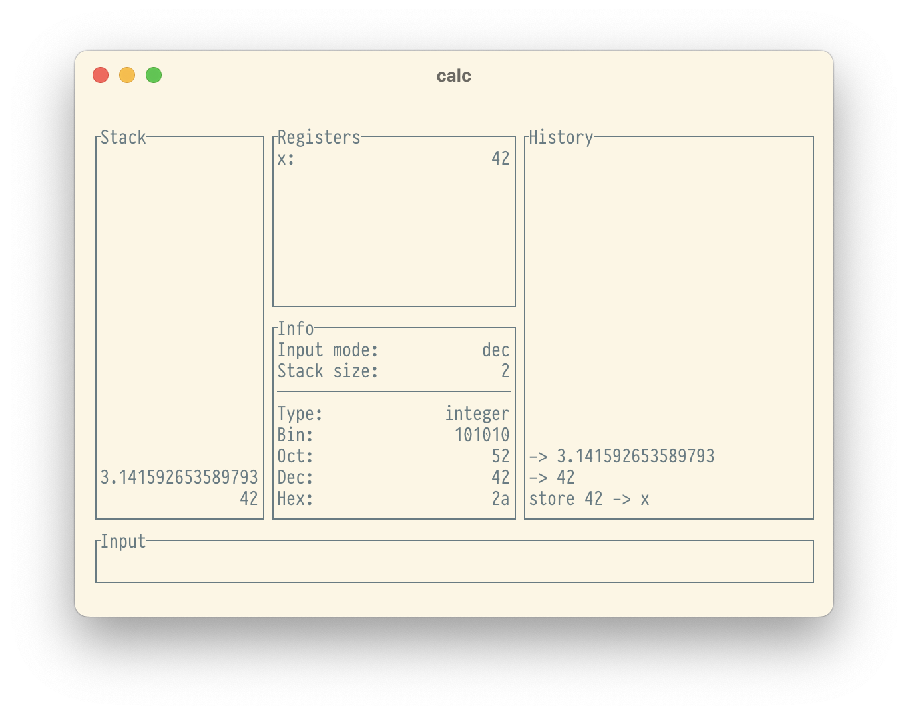

# Calc

_final name pending a creative epiphany, suggestions welcome_

[Reverse Polish
notation](https://en.wikipedia.org/wiki/Reverse_Polish_notation)
calculator for the terminal. Vaguely modelled after PCalc.

## Features

- Reasonable, opinionated set of operations
- 128-bit integers and 64-bit floating point numbers throughout
- Binary, octal, decimal, and hexadecimal input and display
- 52 registers
- Unlimited history and undo (subject to memory availability)

## Usage

Install with `cargo install --path .` for the time being.

Hit `h` upon startup to get a list of keybindings.

## Development

It's a Cargo project, so all the usual apply, `cargo build`, `cargo
run`, `cargo test`, `cargo doc`, etc.
